<!--  -->

--- 

## 👋 About Me

I am a **passionate MERN Stack Web Developer** focused on building scalable, secure, and responsive web applications. My expertise lies in **clean architecture, modern dashboards, and user‑friendly interfaces**. 

My core stack includes **React, Next.js, Node.js, Express, and MongoDB**, enabling me to deliver production‑ready full‑stack solutions. I believe in continuous learning and creating real products with professionalism.

---
## 🚀 Current Activities
- Exploring **Next.js** for advanced SSR and routing  
- Learning **state management patterns** with Redux Toolkit  
- Improving skills in **advanced MongoDB aggregation pipelines** for complex data processing and analytics  

---
##  <b> Skills & Tools</b>

### 🌐 Frontend

### 🖥️ Backend

### 🧰 Tools

---
<!--- statistics --->
## <b> GitHub Overview:</b>

<!-- |  | | -->

| GitHub Streak | Top Languages |
|---------------|---------------|
|| |

---
## 📊 Contributions Overview

| 🔝 Top Contributed Repositories | ⚡ Contribution Statistics |
|----------------------------------|-----------------------------|
|  |   |

---

## ⏱ Productivity & Activity

  

  <!--  -->
   

----

## 🐍 Watch the Snake Eat My GitHub Contributions  
>See how my daily commits slither into action — one square at a time!

---

## 🌟 Profile Highlights  

  

<!--- socials --->
## <b> FOLLOW ME ON SOCIALS: </b>

  
  

---

  

