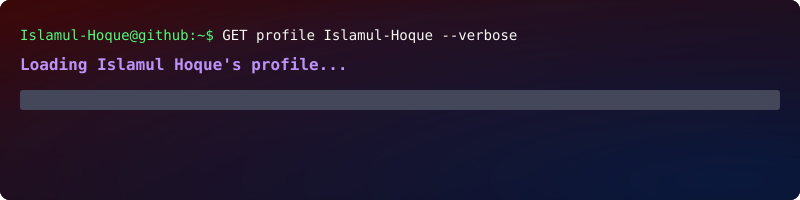

<!--  -->

  
  
  

<!-- About Me -->
##   <b> About Me </b>

I am a **passionate Full‑Stack Web Developer** focused on building **production‑grade, high‑performance optimized web applications**. My expertise lies in **clean architecture, scalable solutions, and user‑friendly interfaces**.

My core stack includes **TypeScript, Next.js, Node.js, modular Express backends, MongoDB and PostgreSQL**, enabling me to deliver enterprise‑level full‑stack solutions with efficiency and reliability.  

Alongside web development, I am actively learning **Data Structures & Algorithms (DSA) with C++**, strengthening my **critical and logical thinking, analytical problem‑solving skills**. 

<!-- Current Activities -->
##  <b> Current Activities </b>

- Enhancing backend architecture with **PostgreSQL (Neon Cloud)** for scalable and efficient data management  
- Deepening expertise in **Redux Toolkit** for advanced state management patterns  
- Expanding knowledge of **MongoDB aggregation pipelines** to handle complex analytics and data processing  
- Strengthening proficiency in **TypeScript’s advanced type system** for building maintainable, type‑safe applications  
- Practicing **Data Structures & Algorithms (DSA) with C++** to sharpen critical and logical thinking, and improve analytical problem‑solving skills  

<!-- Skills & Tools -->
##  <b> Skills & Tools </b>

###  Programming Languages

###  Frontend Development

###  Backend Development
 

###  Tools & Platforms

<!--- statistics --->
## <b> GitHub Overview:</b>

<!-- |  | | -->

| GitHub Streak | Top Languages |
|---------------|---------------|
|| |

<!-- most-commit-language ,repos-per-language -->

## 📊 Contributions Overview

| 🔝 Top Contributed Repositories | ⚡ Contribution Statistics |
|----------------------------------|-----------------------------|
|  |   |

## ⏱ Productivity & Activity
<!-- 

  

 -->

  

  <!--  -->
   <!--  -->

## 🐍 Watch the Snake Eat My GitHub Contributions  
>See how my daily commits slither into action — one square at a time!

##  <b> GitHub Trophies </b>

  

<!--- ## 🌟 Profile Highlights  

  

 --->

<!--- socials --->
## <b> Connect With Me </b>

  
  <!--  -->
  

  
    
  

<!-- 

  

 -->

<!--  -->
<!-- 

  

 -->

  

